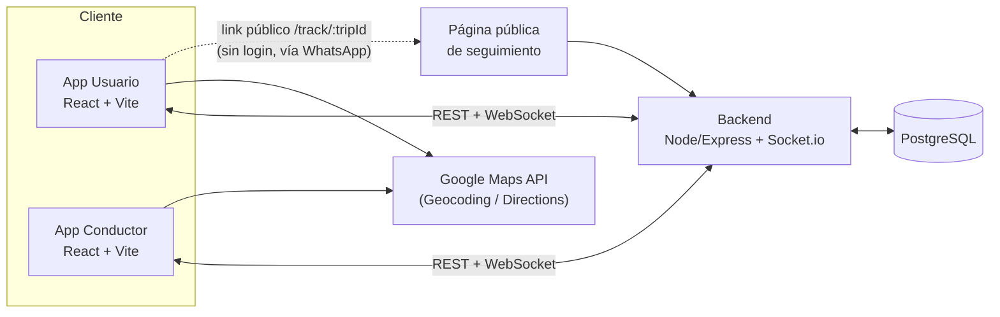

# YoBorracho

**"Uber inverso": un conductor verificado va hasta donde estás y te lleva a tu casa manejando tu propio auto — no el suyo.**

Resuelve el problema que ni Uber ni Cabify resuelven: volver a tu casa después de tomar sin dejar tu auto varado en la calle. El costo del regreso del conductor ya está incluido en la tarifa que pagás.

> Proyecto personal full-stack (frontend + backend + base de datos + tiempo real), construido de punta a punta como pieza de portfolio.

## Demo

- **Demo en vivo:** _(pendiente de despliegue)_
- **Video / capturas del flujo:** _(pendiente — agregar acá un GIF corto del flujo pedido → viaje → llegada)_

Usuarios de prueba (cargados por el seed):

| Email           | Contraseña | Rol       |
|-----------------|------------|-----------|
| sofia@test.com  | 123        | usuario   |
| martin@test.com | 123        | conductor |

## El problema y la propuesta de valor

|                          | Para el usuario                             | Para el conductor                              |
|--------------------------|----------------------------------------------|--------------------------------------------------|
| Llega a casa **con su auto**, no lo deja varado | Precio fijo conocido antes de confirmar | Ingresos flexibles sin necesitar vehículo propio |
| Conductor verificado      | Tracking GPS en tiempo real del trayecto     | El regreso a su casa ya está pagado en la tarifa |

Diferencial frente a Uber/Cabify: el conductor maneja **el auto del usuario**, no el propio — eso es lo que resuelve el problema real (el auto varado), no solo el traslado de la persona.

## Cómo funciona (flujo completo del viaje)

1. **Solicitud** — el usuario pide el viaje con origen, destino y su auto.
2. **Matching** — la plataforma lista el pedido a conductores disponibles en la zona.
3. **Aceptación** — un conductor lo acepta; el usuario ve su nombre y calificación.
4. **Traslado al punto** — el conductor se acerca (por su cuenta, no con auto propio).
5. **Verificación** — se confirma identidad al encuentro.
6. **Viaje** — el conductor maneja el auto del usuario a destino; tracking en vivo por WebSocket, con opción de compartir el seguimiento en tiempo real por WhatsApp (link público, sin necesidad de la app) a un contacto de confianza.
7. **Llegada** — el viaje se marca completo y se calcula el cobro.
8. **Regreso del conductor** — botón con deep link a Uber para pedir su regreso, más un recordatorio automático si se olvida de cerrar el viaje.
9. **Calificación diferida y doble ciego** — ninguna de las dos partes ve la calificación de la otra hasta que ambas calificaron.

La documentación de producto completa (actores, modelo de negocio, reglas de negocio, riesgos) está en [`YoBorracho_ModeloDominio.docx`](./YoBorracho_ModeloDominio.docx) y en el registro de diseño en [`YoBorracho_Chat.md`](./YoBorracho_Chat.md).

## Arquitectura



Una misma base de código de React sirve las pantallas de usuario y de conductor (rutas separadas, un rol por sesión). El backend expone REST para todo el CRUD y un canal de WebSocket (Socket.io, una room por viaje) para ubicación en vivo y cambios de estado; el frontend tiene un polling de respaldo por si el socket se cae. La única ruta pública sin autenticación es `/track/:tripId`, pensada para compartirse fuera de la app.

## Stack técnico

**Frontend** — React 19, Vite, React Router v7, Tailwind CSS, `@react-google-maps/api`, `socket.io-client`, `lucide-react`.

**Backend** — Node.js + Express, PostgreSQL (SQL crudo vía `pg`, sin ORM), Socket.io, JWT (`jsonwebtoken` + `bcryptjs`), validación con `zod`.

**Infra** — Docker Compose (postgres + backend + frontend), migraciones versionadas y auto-aplicadas al arrancar.

## Cómo correrlo localmente

Requiere [Docker Desktop](https://www.docker.com/products/docker-desktop/) y una API key de Google Maps propia (Maps JavaScript API + Geocoding API + Directions API habilitadas).

```bash
cp .env.example .env                          # JWT_SECRET — generá uno propio, no uses el de ejemplo
cd yoborracho && cp .env.example .env && cd .. # pegar tu VITE_GOOGLE_MAPS_API_KEY
docker compose up --build
docker compose run --rm backend npm run seed   # una sola vez, carga usuarios y viajes de ejemplo
```

Esto levanta Postgres en `:5432`, la API en `http://localhost:3001` y el frontend en `http://localhost:5173`. Instrucciones sin Docker, referencia completa de la API y modelo de datos: [`backend/README.md`](./backend/README.md).

### Probar el flujo completo requiere dos sesiones

El viaje lo hace avanzar el **conductor**, no el usuario que pide (esto es intencional: el usuario solo observa, para que no se puedan pisar los estados entre las dos puntas). Por eso, para probar el flujo completo — desde que se pide el viaje hasta que el conductor confirma el regreso — hacen falta **dos sesiones logueadas al mismo tiempo, una por rol**:

1. Abrí dos navegadores distintos, o el navegador normal + una ventana de incógnito (no dos pestañas del mismo navegador normal: comparten `localStorage` y una sesión pisa a la otra).
2. En una, entrá como usuario (`sofia@test.com`); en la otra, como conductor (`martin@test.com`).
3. Pedí el viaje desde la sesión de usuario y aceptalo/avanzalo desde la sesión de conductor.

Con una sola sesión podés navegar y ver todas las pantallas, pero el viaje se queda esperando a que la otra parte actúe — eso es esperado, no un bug.

## Deploy

Guía paso a paso para desplegar el stack completo (frontend, backend y Postgres) en Render: [`DEPLOY.md`](./DEPLOY.md).

## Estado del proyecto

Es un prototipo funcional de punta a punta (no un producto en producción): la verificación de conductores, el cobro y la acreditación de fondos son simulados, no hay integración con una pasarela de pago ni con organismos reales (RENAPER, antecedentes penales, etc.). El flujo de viaje, el tracking en tiempo real, las calificaciones diferidas y doble ciego, y el reparto de tarifa 65/20/10/5 sí están implementados y son reales dentro del alcance de esta demo.

## Estructura del repo

```
YoBorracho/
  yoborracho/          frontend (React + Vite) — ver yoborracho/README.md
  backend/              API REST + WebSocket — ver backend/README.md
  docker-compose.yml    orquesta postgres + backend + frontend
  YoBorracho_ModeloDominio.docx   documentación de producto (modelo de dominio)
  YoBorracho_Chat.md              registro del proceso de diseño
```

## Licencia

MIT — ver [`LICENSE`](./LICENSE).
